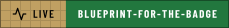
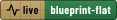
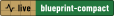
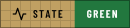
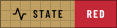
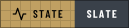
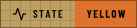

<!--
title: '🎨 GALLERY'
description: 'Every icon, color token and style the Badge Kit can draw, rendered rather than listed.'
tags: [badges, icons, palette, reference]
category: docs
-->

<!-- markdownlint-disable MD041 -->
<!-- GENERATED BY src/badge-kit.py --gallery. Do not edit by hand: run `make gallery`. -->

# 🎨 GALLERY

**Everything the kit can draw, drawn.**

_Pick by eye, copy the name._

---

## 🧭 Contents

| Section | Count | What the name is for |
| :--- | ---: | :--- |
| [🖋️ Icons](#️-icons) | 64 | The value of `icon:` |
| [🎨 Color tokens](#-color-tokens) | 64 | The value of `label_color:` or `message_color:` |
| [🧱 Styles](#-styles) | 6 | The value of `style:` |
| [🚦 Health colors](#-health-colors) | 4 | What a gold label may paint its message |
| [📐 Blueprint plates](#-blueprint-plates) | 6 | The value of `style:` for a plate |
| [🖨️ Prints](#️-prints) | 11 | The value of `print:` |

Every badge below carries its own name, so the thing you look at and the thing
you type are the same badge. Nothing on this page is fetched: each one is a
committed SVG in this repository.

Combined, these make **1,574,040 visually distinct
badges** before you have written a single word of label or message, which is
what makes the real number unbounded. Of those, 1,572,480
are static and only 1,560 are health badges: the
traffic-light rule refuses 60 of the
4096 colour pairs, which is why a status signal has almost no
room to be creative in.

---

## 🖋️ Icons

64 line glyphs on a 24x24 grid, stroked in the label's ink color so
they read on any background. Grouped by what they are for, because reading 64
alphabetically to find one is not browsing.

[Status & health](#status--health) &middot; [Security](#security) &middot; [Code & build](#code--build) &middot; [Ship & run](#ship--run) &middot; [Docs & data](#docs--data) &middot; [People](#people) &middot; [Time & place](#time--place) &middot; [Shapes & marks](#shapes--marks)

#### Status & health

#### Security

#### Code & build

#### Ship & run

#### Docs & data

#### People

#### Time & place

#### Shapes & marks

---

## 🎨 Color Tokens

64 tokens, one per icon, tuned to a single saturation and lightness
family so any two sit together without clashing. Each was checked against every
other and clears the palette's own minimum spacing, so no two read as the same
color. A raw `#RRGGBB` works anywhere a token does.

Grouped by hue and ordered within each group, so a row reads as a gradient and
you can pick a neighbour when one is not quite right. Watch the ink flip to
dark on the light tokens: that is chosen by luminance, not from a list.

[Reds](#reds) &middot; [Oranges](#oranges) &middot; [Yellows](#yellows) &middot; [Greens](#greens) &middot; [Cyans & teals](#cyans--teals) &middot; [Blues](#blues) &middot; [Violets](#violets) &middot; [Pinks & magentas](#pinks--magentas) &middot; [Neutrals](#neutrals)

#### Reds

#### Oranges

#### Yellows

#### Greens

#### Cyans & teals

#### Blues

#### Violets

#### Pinks & magentas

#### Neutrals

---

## 🧱 Styles

The same badge 6 ways, grouped by the job you are picking one for.
`for-the-badge` is the default. A style is geometry and nothing else: a corner
radius, an optional overlay gradient, and a scale applied to the metric
tables, so every one of these measures its text exactly rather than
approximately.

#### Headline

Bold uppercase and letter-spaced. Mastheads, and the document headers the styling standard expects.

#### Standard

Natural case, for a body row. The same chip square, rounded, bevelled, or fully round.

#### Dense

Shorter than a line of text, for a table of many badges or one sitting inline in a sentence.

---

## 🚦 Health Colors

A **gold label** marks a value that changes over time, so its color has to mean
something. The message is restricted to these, and any other hue on a gold
label is rejected at render time rather than quietly drawn.

---

## 📐 Blueprint Plates

Every style again, drawn the way
[`tannergolden/banners`](https://github.com/tannergolden/banners) draws a
header: the label lettered on drafting paper, the value on a solid block of the
print, and the plate framed in the print's line. Each keeps its style's height,
corner, padding and case, so swapping a style for its twin never moves a row.

The lettering is outlined Barlow Condensed, a path per glyph, so it looks the
same on every device. A static plate is two files, one for each theme GitHub
paints, and the day file is shown here unless your theme is dark. The live
plate beside each one is a gold label: its value is drawn in the state's
print, one file for either theme.

<picture><source media="(prefers-color-scheme: dark)" srcset="../assets/badges/static/gallery-blueprint-for-the-badge-dark.svg"></picture>

<picture><source media="(prefers-color-scheme: dark)" srcset="../assets/badges/static/gallery-blueprint-flat-dark.svg"></picture>

<picture><source media="(prefers-color-scheme: dark)" srcset="../assets/badges/static/gallery-blueprint-flat-square-dark.svg"></picture>

<picture><source media="(prefers-color-scheme: dark)" srcset="../assets/badges/static/gallery-blueprint-plastic-dark.svg"></picture>

<picture><source media="(prefers-color-scheme: dark)" srcset="../assets/badges/static/gallery-blueprint-pill-dark.svg"></picture>

<picture><source media="(prefers-color-scheme: dark)" srcset="../assets/badges/static/gallery-blueprint-compact-dark.svg"></picture>

---

## 🖨️ Prints

A static plate's colour is its **print**, the colour a drawing is reproduced
in: its lines on white paper by day, and by night the sheet those lines are
printed on. `blueprint` is the default. These are the same eleven the banners
draw in, so a row of plates matches the banner above it.

<picture><source media="(prefers-color-scheme: dark)" srcset="../assets/badges/static/gallery-print-redprint-dark.svg"></picture>
<picture><source media="(prefers-color-scheme: dark)" srcset="../assets/badges/static/gallery-print-orangeprint-dark.svg"></picture>
<picture><source media="(prefers-color-scheme: dark)" srcset="../assets/badges/static/gallery-print-yellowprint-dark.svg"></picture>

<picture><source media="(prefers-color-scheme: dark)" srcset="../assets/badges/static/gallery-print-greenprint-dark.svg"></picture>
<picture><source media="(prefers-color-scheme: dark)" srcset="../assets/badges/static/gallery-print-tealprint-dark.svg"></picture>
<picture><source media="(prefers-color-scheme: dark)" srcset="../assets/badges/static/gallery-print-blueprint-dark.svg"></picture>

<picture><source media="(prefers-color-scheme: dark)" srcset="../assets/badges/static/gallery-print-indigoprint-dark.svg"></picture>
<picture><source media="(prefers-color-scheme: dark)" srcset="../assets/badges/static/gallery-print-purpleprint-dark.svg"></picture>
<picture><source media="(prefers-color-scheme: dark)" srcset="../assets/badges/static/gallery-print-pinkprint-dark.svg"></picture>

<picture><source media="(prefers-color-scheme: dark)" srcset="../assets/badges/static/gallery-print-brownprint-dark.svg"></picture>
<picture><source media="(prefers-color-scheme: dark)" srcset="../assets/badges/static/gallery-print-blackprint-dark.svg"></picture>

A live plate takes no print. Its value is drawn in the print its state names,
and yellow is drawn in the orangeprint, since a mustard block beside the gold
sheet would read as one colour:

---

## 🔗 See also

> [!TIP]
> The schema these values go into is [`Badge-Kit.md`](Badge-Kit.md), and
> [`badges.example.yml`](badges.example.yml) is a starter file to copy.

---

**Drawn from the registry, never transcribed.**

[↑ Back to Top](#top)

